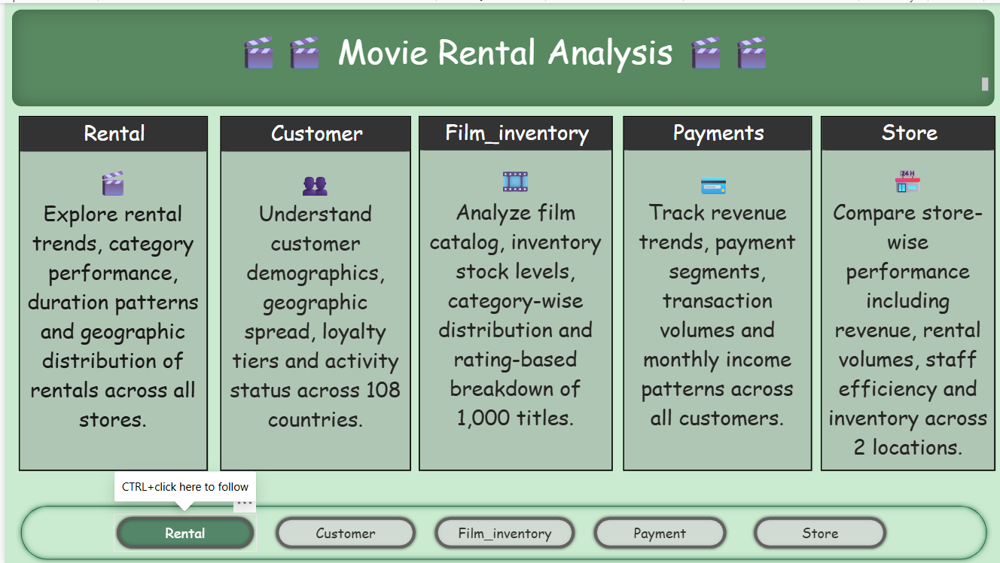
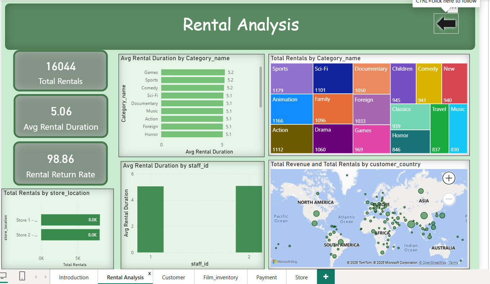
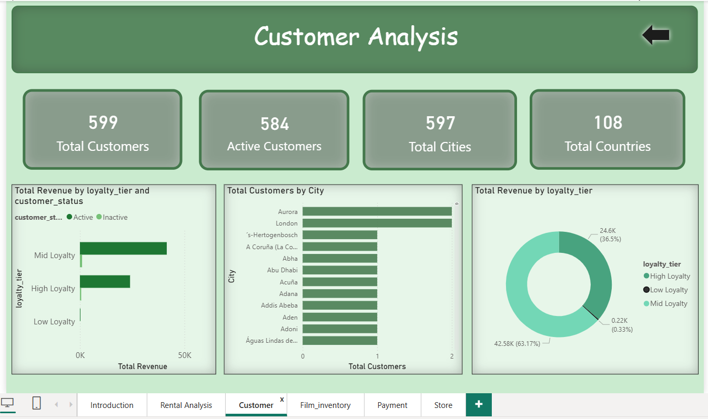
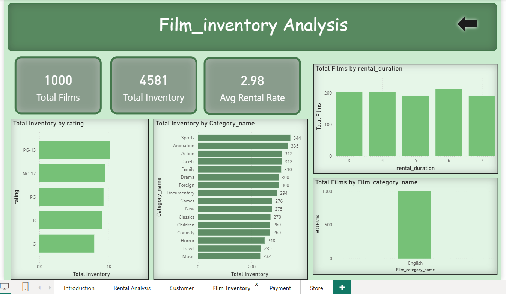
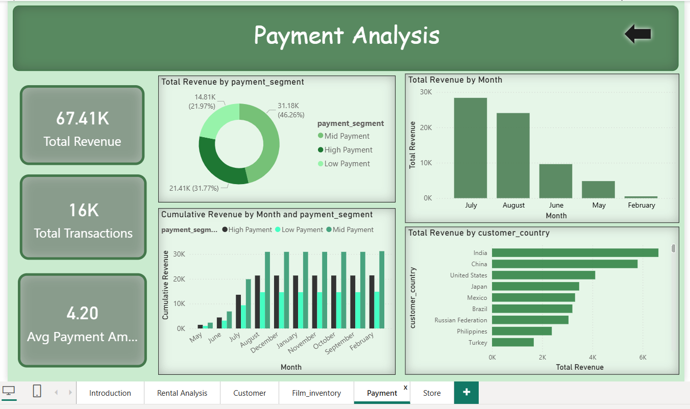
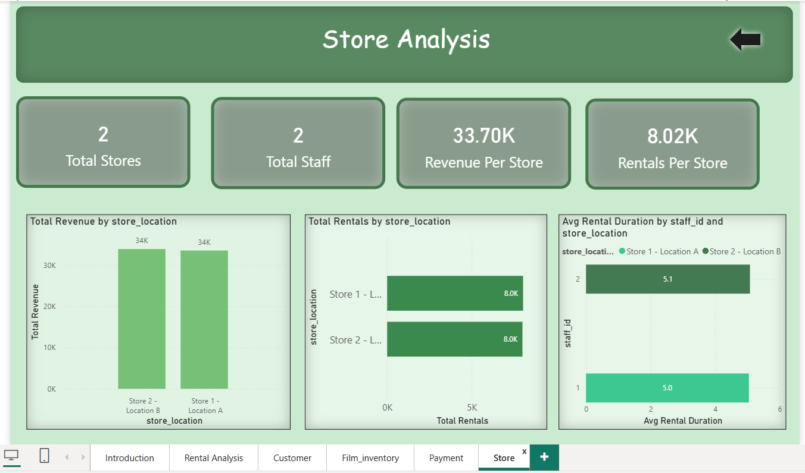

# 🎬 Movie Rental Analysis — Power BI Project

## 📌 Project Overview
This project presents a comprehensive analysis of a DVD rental business
using the **Sakila MySQL Sample Database**. The analysis covers rental 
trends, customer behavior, film inventory, payment patterns, and 
store performance using **Power BI** dashboards.

---

## 🗃️ Dataset
- **Source**: Sakila MySQL Sample Database
- **Tables Used** : rental, payment, customer, film, inventory, 
  store, staff, address, city, country, category, language
- **Total Rentals** : 16,044
- **Total Customers** : 599
- **Total Films** : 1,000
- **Total Inventory** : 4,581
- **Store Locations** : 2
- **Countries Covered** : 108

---

## 🧹 Data Cleaning Steps
- Handled NULL values in `return_date` (unreturned films)
- Removed duplicate records using primary key validation
- Converted date columns to proper DATETIME format
- Joined all tables via foreign key relationships
- Validated outliers — rental durations > 30 days reviewed

---

## 🛠️ Tools Used
- **MySQL** — Data extraction and transformation
- **Power BI** — Data modeling and visualization
- **Excel** —    Data cleaning and handling nulls
- **Problem Solving** - Data Insights and Buisness Analyse

---

## 📊 Dashboard Pages

### 🎬 Page 1 — Rental Analysis
> Explore rental trends, category performance, duration patterns 
> and geographic distribution of rentals across all stores.

### 👥 Page 2 — Customer Analysis
> Understand customer demographics, geographic spread, loyalty 
> tiers and activity status across 108 countries.

---

### 🎞️ Page 3 — Film & Inventory Analysis
> Analyze film catalog, inventory stock levels, category-wise 
> distribution and rating-based breakdown of 1,000 titles.

### 💳 Page 4 — Payment Analysis
> Track revenue trends, payment segments, transaction volumes 
> and monthly income patterns across all customers.
---

### 🏪 Page 5 — Store Analysis
> Compare store-wise performance including revenue, rental 
> volumes, staff efficiency across 2 locations.

---

## 🗺️ Data Model
The data model follows a **Star Schema** structure with:
- **Fact Tables** : rental, payment
- **Dimension Tables** : customer, film, inventory, store, 
  staff, address, city, country, category, language
- **Custom Table** : Custom_calender (Date table)

---

## 💡 Key Insights
- 🏆 **Sports** is the most rented category with **1,179 rentals**
- 💰 **Both stores** generate equal revenue of **~$34K each**
- 🌍 **India** is the top revenue-generating country
- 📅 **July** is the peak revenue month with **~$28K**
- 💳 **Mid Payment** segment contributes **46.26%** of total revenue
- ⭐ **Mid Loyalty** customers drive the most revenue
- 🎬 All **1,000 films** are in **English** language
- 📦 **Sports & Animation** have the highest inventory stock

---

## 📸 Dashboard Preview

### Introduction
.

### 🎬 Rental Analysis

### 👥 Customer Analysis

### 🎞️ Film & Inventory

### 💳 Payment Analysis

### 🏪 Store Analysis

---

## 👤 Author
- **Project** : Movie Rental Analysis
- **Tool** : Power BI
- **Dataset** : Sakila MySQL Sample Database
